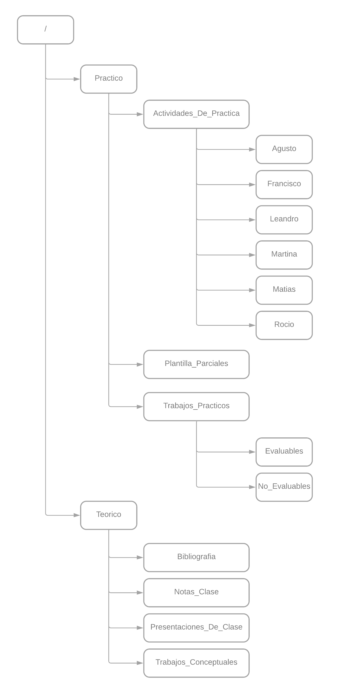

# Universidad Tecnológica Nacional - Facultad Regional de Córdoba - Ingeniería De Software 2023

## Información del curso

### Curso 4K3 - Turno Noche

### Docentes:

- **Adjunto:** Ing. Laura Ines, Covaro
- **Auxiliares de Trabajos Prácticos:** Ing Massano, Maria Cecilia & Avila, Pilar

### Información del grupo

**Grupo número:** 5

| Apellido y Nombre         | Legajo    |
| ---                       | ---       |
| Portela, Augusto          | 75495     |
| Savala, Francisco         | 86146     |
| Gor, Leandro Gabriel      | 85920     |
| Haliska, Martina          | 88304     |
| Gonzalez Autelli, Matias  | 75822     |
| Torti, Rocio              | 86576    |

---

# Estructura del repositorio

---

# Listado de **Ítems de configuración**
 ---
|**Nombre del ítem de Configuración**      | **Regla de Nombrado**                                   |**Ubicación Física**|
| ---                                      | ---                                                     | ---|
|Programa de la materia                    |4K3_ISW_G5_ModalidadAcademica.pdf                        |/|
|Estructura del repositorio                |4K3_ISW_G5_\<Descripcion>.\<Ext>                          |/ |
|Bibliografía                              |4K3_ISW_G5_Bibliografia_\<Titulo>.pdf                     |/Teorico/Bibliografia/ |
|Enunciados prácticos evaluables           |4K3_ISW_G5_TPE_Enunciado.pdf                             |/Practico/Evaluable/ |
|Resolución prácticos evaluables           |4K3_ISW_G5_TPE_\<NroTrabajo>\_Resolucion_\<Descripcion>.\<Ext>            |/Practico/Evaluable/ |
|Enunciados prácticos No Evaluables        |4K3_ISW_G5_TPNE_Enunciados.pdf                           |/Practico/No_Evaluable/ |
|Resolución Prácticos No Evaluables        |4K3_ISW_G5_TPNE_\<NroTrabajo>\_Resolucion_\<Descripcion>.\<Ext>            |/Practico/No_Evaluable/ |
|Plantillas                                |4K3_ISW_G5_PLA_\<Descripcion>.\<Ext>                       |/Practico/Plantillas/ |
|Enunciados Trabajos Prácticos Conceptuales|4K3_ISW_G5_TC_Enunciados.pdf                             |/Teorico/Trabajos_Conceptuales/ |
|Resolución Trabajos Prácticos Conceptuales|4K3_ISW_G5_TC_\<NroTrabajo>\_Resolucion_\<Descripcion>.\<Ext>|/Teorico/Trabajos_Conceptuales/ |
|Filminas de Clases                        |4K3_ISW_G5_Filmina_U\<X>_\<Descripcion>.pdf                |/Teorico/Presentaciones_De_Clase/ |
|Notas de clase teóricas                   |4K3_ISW_G5_\<Descripcion>_\<Alumno>.\<Ext>                  |/Teorico/Notas_Clase/ |
|Actividades practicas realizadas          |4K3_ISW_G5_\<Descripcion>_\<Ext>                           |/Practico/Actividades_De_Practica/\<Alumno>/ |

---

## Glosario

|**Sigla**                                 | **Descripcion**                                  
| ---                                      | ---                                                    
|\<Ext>                                     |Utilizado para representar que los Ítem de configuración cuya regla de nombre incluye este término pueden tener diferentes extensiones y tipos de archivos  |                      
|\<Descripcion>                             |Frase breve y representativa del contenido del Ítem de configuración. |                           
| \<Titulo>                                 |Título del documento|                    
| \<NroTrabajo>                             |Corresponde la numeración de los trabajos conceptuales y prácticos en dos dígitos. Ejemplo: “01”|                          
| \<X>                                      |Corresponde al número de la unidad correspondiente en dos dígitos. Ejemplo: “01”|           
| \<Alumno>                                |Nombre del alumno en cuestión que realizó la tarea.|                        
| \<4K3 >                                     |Nombre del curso  |           
| \<ISW>                                      |Ingeniería de Software: Nombre de la cátedra|                     
| \<G5>                                       |Grupo 5: Numero del grupo |                            
                        

---

# **Regla de determinación de línea base**

Consideramos que el momento más adecuado para establecer una línea base con el conjunto de elementos de configuración creados y sus respectivas versiones, será cada 2 (dos) semanas, para llevar actualizado el repositorio. Las fechas son:

    -  Sabado 30/09/2023
    -  Sabado 14/10/2023
    -  Sabado 28/10/2023
    -  Sabado 11/11/2023
    -  Sabado 25/11/2023

Para dicho fin utilizaremos la funcionalidad “tags” incorporada dentro de la herramienta Git.