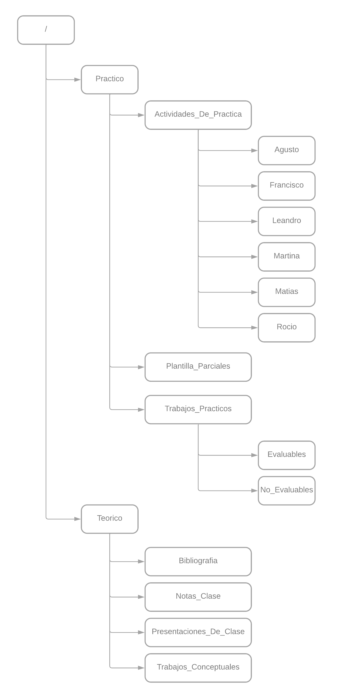

# Universidad Tecnológica Nacional - Facultad Regional de Córdoba - Ingeniería De Software 2023

## Información del curso

### Curso 4K3 - Turno Noche

### Docentes:

- **Adjunto:** Ing. Laura Ines, Covaro
- **Auxiliares de Trabajos Prácticos:** Ing Massano, Maria Cecilia & Avila, Pilar

### Información del grupo

**Grupo número:** 5

| Apellido y Nombre         | Legajo    |
| ---                       | ---       |
| Augusto                   |           |
| Francisco                 |           |
| Leandro                   |           |
| Martina                   |           |
| Gonzalez Autelli, Matias  | 75822     |
| Rocio                     |           |

---

# Estructura del repositorio

---

# Listado de **Ítems de configuración**

---

## Glosario

---

# **Regla de determinación de línea base**